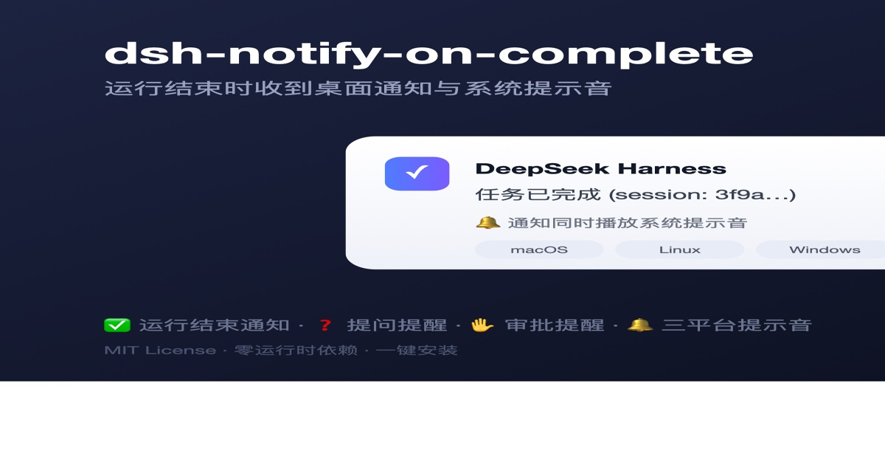

> [English](README.md) · 中文文档

# dsh-notify-on-complete

<p align="center"></p>

DeepSeek Harness 插件：每次 dsh 运行结束时向操作系统发送桌面通知，提示用户工作已完成；会话进行中模型提问或等待审批时也会即时通知提醒你回来处理。正文按结果区分（成功 / 失败 / 中止 / 达到 token 上限）。

> 作者：[Luozy](https://github.com/pitetow) · 协议：[MIT](LICENSE)

- 零运行时依赖：不依赖 dsh 内部包，也不依赖 `ctx.shell` 服务，通知用 `child_process.spawn` 以 detached 子进程发出，**不阻塞、也不被 harness 退出流程影响**。
- 跨平台：按 `process.platform` 自动选择通知命令（macOS `osascript` / Linux `notify-send`→`kdialog` / Windows PowerShell）。不支持的平台加载时跳过并打警告，不会在每个事件里抛错。
- 通知带系统提示音：macOS 用系统默认提示音（`sound name "Glass"`）、Windows 用 .NET SystemSounds、Linux 用 `canberra-gtk-play`（缺失时回退 `paplay`）；可用 `sound: false` 关闭。
- 会话中阻塞即时通知：模型调用 `ask_user_question` 提问、或沙箱提权/工具权限等待审批时立即弹通知提醒你回来（正文含问题文本 / 工具名与原因），可用 `onBlocked` / `onQuestion` / `onApproval` 精细控制。
- 只通知顶层运行：子代理（subagent）会话被过滤（`header.origin === 'subagent'`），一次 CLI 运行只弹一条通知。

## 工作原理

插件监听两个事件，协同判定"一次运行结束"：

1. **`session/event` → `turn/end`**：记录根会话（`origin !== 'subagent'`）最近一次轮次结束的 `reason.kind`。一次运行可能跨多个轮次（goal 多轮、follow-up、steering），每一轮都有自己的 `turn/end`，插件只记住**最后一次**的结果。
2. **`agent/status` → `'idle'`**：这是 harness 自己定义的"运行结束"信号（web 界面的 running 指示器、`agent.whenIdle()` 都基于它）。根 agent 回到 idle 表示整段活动（含所有轮次）收敛完成，此时把记下的最终结果发出去，并清除记录。

所以**每条通知对应一次完整的运行**，而不是每一轮：多轮 goal run 只在整场跑完时弹一条，且正文是最终结果；中途的"任务已完成"不会提前弹出。通知正文格式：`结果文本 — 会话标题 (session: 会话ID)`，例如 `任务已完成 — 修复登录bug (session: 3f9a…)`；会话标题还没生成时退化为 `结果文本 (session: 会话ID)`。标题来自会话日志里最后一条 `session/title` 事件，是异步投影——极早期通知（如会话刚开始就提问）可能还没有标题，属预期。通知命令以 `detached: true` + `unref()` 发出，harness 正常退出或崩溃都不会影响通知送达。

| `reason.kind` | 通知正文 |
|---|---|
| `completed` | 任务已完成 |
| `error` | 任务失败 |
| `aborted` | 任务已中止 |
| `max-tokens` | 任务达到 token 上限 |
| 其他（未知） | 任务结束 |

## 环境要求

- Node.js ^22（与 DeepSeek Harness 一致）
- 已安装的 dsh CLI（任意版本，插件通过 Cordis 事件注册，不依赖 CLI 特定版本）
- peer 依赖 `@deepseek-ai/cordis@^4.0.1`（由 dsh CLI 自身提供，安装时 pnpm 会自动解析）

---

## 安装（一键脚本，GitHub 源码分发，无需 npm）

**前置**：已装好 DSH（`dsh web` 能正常运行），Node.js ^22 + pnpm。

**macOS / Linux / Windows（Git Bash 或 WSL）**：

```bash
curl -fsSL https://raw.githubusercontent.com/pitetow/dsh-notify-on-complete/main/scripts/install.sh | bash
```

其他 profile（默认 `web`）：

```bash
curl -fsSL https://raw.githubusercontent.com/pitetow/dsh-notify-on-complete/main/scripts/install.sh | bash -s -- --profile headless
```

脚本自动完成 4 件事（全部幂等，可安全重复执行）：

1. 下载源码到 `~/.dsh/plugins/dsh-notify-on-complete/`（已存在则跳过，**不会覆盖**；加 `--force` 才覆盖更新，覆盖前会询问确认，`--yes` 跳过确认）；
2. `pnpm install && pnpm build` 构建产物；
3. `dsh plugin --profile <名> add link:<目录>`：CLI 识别包内 `dsh.bundle.patch` 声明（`cordis.patch.yml`），**自动注册进 profile 的 bundle 栈**，下次启动自动挂载——不需要手动编辑任何配置文件；
4. 幂等移除旧版残留的手动挂载行，避免双挂载（一次运行弹两条通知）。

`curl | bash` 会执行远程代码——脚本随仓库开源（`scripts/install.sh`），可先下载审阅。

### 验证

```bash
dsh --profile web --dump-config | grep -n notify-on-complete
```

能输出 `- id: notify-on-complete` 及其后的 `name: dsh-notify-on-complete` 行，说明插件已进入合成树。再跑一次真实任务，看到桌面通知弹出即安装成功。

重启生效：

- **CLI 一次性运行**：下次运行 `dsh --profile headless "任务"` 时自然生效，无需额外操作。
- **Web GUI**：重启 web 进程（结束当前 `dsh web` 进程后重新启动）。若部署启用了 HMR 热更新，保存文件后会自动生效。

### 更新

```bash
curl -fsSL https://raw.githubusercontent.com/pitetow/dsh-notify-on-complete/main/scripts/install.sh | bash -s -- --force
```

> `--force` 会删除旧源码重新下载（该目录内的本地改动会丢失），**覆盖前会询问确认**；无人值守场景加 `--yes` 跳过确认：
> `bash -s -- --force --yes`

或手动：`cd ~/.dsh/plugins/dsh-notify-on-complete && git pull && pnpm install && pnpm run build` 后重跑 `dsh plugin --profile web add link:.`。

### 卸载

```bash
dsh plugin --profile web remove dsh-notify-on-complete
rm -rf ~/.dsh/plugins/dsh-notify-on-complete
```

然后重启 dsh 进程。

<details>
<summary><b>手动安装（从源码 / 本地开发调试，与一键脚本二选一）</b></summary>

把依赖指向本地源码（`link:` 是符号链接，改代码后重建即生效，适合调试）：

```bash
cd /path/to/dsh-notify-on-complete
pnpm install
pnpm run build                              # 产物输出到 lib/
dsh plugin --profile web add link:/path/to/dsh-notify-on-complete
```

装完后检查 `~/.dsh/profiles/web/package.json`，dependencies 里应出现 `dsh-notify-on-complete`：

```bash
grep dsh-notify ~/.dsh/profiles/web/package.json
```

> 若 CLI 提示 `declares no dsh.bundle — installed as a plain dependency`，说明它没有自动挂载，需要在 profile 用户层手动声明。编辑 `~/.dsh/profiles/web/cordis.patch.yml`，加入：

```yaml
# 你的 profile 用户层（cordis.patch.yml）
- id: notify-on-complete
  name: dsh-notify-on-complete
  config:
    enabled: true              # 默认 true，不写也行
    title: DeepSeek Harness    # 通知标题，不写也行
```

> 若之前用一键脚本装过，再手动挂载会造成双挂载（一次运行弹两条通知）——切换通道前先 `dsh plugin --profile web remove dsh-notify-on-complete`。

</details>

---

## 设置面板（Web GUI）

打开 **dsh web → 设置 → 插件**，找到 **notify-on-complete** 分区即可可视化配置——面板由插件声明的 schema 自动渲染，**无需手动编辑 `cordis.patch.yml`**：

- **enabled / title / sound / onBlocked / onQuestion / onApproval** —— 与配置文件相同的开关。
- **sounds** —— 每档事件音色（macOS 音色名如 Glass / Sosumi / Ping / Funk，或 `default`）：完成、失败、提问/审批三档可分别更换。macOS 上 `default` 表示**不响铃**（可当作单档静音）；Windows 与 Linux 会把 `default` 映射为各自的平台默认提示音。
- **quietHours** —— 勿扰时段 `"HH:MM-HH:MM"`（开始晚于结束表示跨天）；时段内完全不弹通知也不响铃。示例：`["23:00-08:00"]`。

面板值优先于 profile 的 `cordis.patch.yml`；没动过的字段回退到配置文件，再到默认值。无设置服务的场景（如 CLI 一次性运行）按配置文件工作，行为不变。

## 配置

配置写在 **profile 的 `cordis.patch.yml`** 里（用户层，最后应用、按行胜出）：

| profile | 配置文件路径 |
|---|---|
| `web`（默认，`dsh web`） | `~/.dsh/profiles/web/cordis.patch.yml` |
| `headless`（`dsh --profile headless`） | `~/.dsh/profiles/headless/cordis.patch.yml` |
| 其它 `<名>` | `~/.dsh/profiles/<名>/cordis.patch.yml` |

> 也可写在 home 级 `$DSH_HOME/cordis.patch.yml`（默认 `~/.dsh/cordis.patch.yml`），所有 profile 共享。

配置方式是**用 `id: notify-on-complete` 声明/覆盖这一行**。注意：

- 后应用的层会**整体替换**同名 `id` 行的 `config`（不是按键深度合并），所以要么写全 `id` + `name` + `config`，要么只写你想改的键、其余交给插件默认值。
- `cordis.patch.yml` 必须是**顶层 YAML 数组**（以 `-` 开头）；全部删光后请写 `[]`。

完整配置示例（所有字段 + 默认值）：

```yaml
# ~/.dsh/profiles/web/cordis.patch.yml
- id: notify-on-complete
  name: dsh-notify-on-complete
  config:
    enabled: true        # 总开关；false 完全关闭
    title: DeepSeek Harness
    sound: true          # 提示音；false 只弹通知不出声
    onBlocked: true      # 阻塞通知总开关（提问 + 审批）
    onQuestion: true     # 提问类通知（仅 onBlocked: true 时生效）
    onApproval: true     # 审批/权限类通知（仅 onBlocked: true 时生效）
```

常用场景：

```yaml
# 仅提示、不要提示音
- id: notify-on-complete
  name: dsh-notify-on-complete
  config:
    sound: false

# 仅任务完成后提示，提问 / 审批等阻塞不提示
- id: notify-on-complete
  name: dsh-notify-on-complete
  config:
    onBlocked: false

# 完成后 + 提问都提示，但审批（沙箱提权 / 工具权限）不提示
- id: notify-on-complete
  name: dsh-notify-on-complete
  config:
    onApproval: false
```

### 字段表

| 字段 | 类型 | 默认值 | 说明 |
|---|---|---|---|
| `enabled` | boolean | `true` | 设为 `false` 时插件不注册任何监听，完全关闭 |
| `title` | string | `DeepSeek Harness` | 系统通知的标题 |
| `sound` | boolean | `true` | 通知时同时播放系统提示音；设为 `false` 只弹通知不出声 |
| `onBlocked` | boolean | `true` | 阻塞通知总开关；设为 `false` 完全关闭提问+审批通知 |
| `onQuestion` | boolean | `true` | 提问类（`ask_user_question`）通知开关；仅在 `onBlocked: true` 时生效 |
| `onApproval` | boolean | `true` | 审批/权限类通知开关；仅在 `onBlocked: true` 时生效 |
| `sounds` | object | `{completed: "Glass", error: "Sosumi", approval: "Ping"}` | 每档事件的音色（macOS 音色名或 `default`） |
| `quietHours` | string[] | `[]` | 勿扰时段 `"HH:MM-HH:MM"`（开始晚于结束表示跨天）；时段内完全不通知 |

配置校验在加载时执行（fail loud）：类型错误会在启动时报错，不会静默忽略。

改完配置需重启生效：CLI 一次性运行下次自然生效；`dsh web` 需重启 web 进程。

验证配置是否生效：

```bash
dsh --profile web --dump-config | grep -n -A 10 notify-on-complete
```

输出里能看到你写的 `config:` 值即已生效。

## 平台命令

| 平台 | 命令 | 备注 |
|---|---|---|
| macOS | `osascript -e 'display notification …'` | 原生通知中心通知，带系统提示音（`sound name "Glass"`） |
| Linux | `notify-send` | 缺失时自动回退 `kdialog --passivepopup`；提示音走 `canberra-gtk-play`（缺失时回退 `paplay`） |
| Windows | PowerShell `WScript.Shell.Popup` | 无需额外模块，5 秒自动关闭，带 .NET SystemSounds 提示音 |

> macOS 首次使用可能需要给终端应用授予"通知"权限（系统设置 → 通知）。

## 常见问题

**Q：一次运行弹两条通知？**
双挂载：profile 的 `cordis.patch.yml` 里还留着旧的手动挂载行。删掉那段 `- id: notify-on-complete` 条目（一键脚本会自动清理），只保留 bundle 自动挂载即可。注意 `cordis.patch.yml` 必须是顶层 YAML 数组——全部删光后请写 `[]`。

**Q：装了但通知不弹？**
1. 先确认加载成功：`dsh --profile web --dump-config | grep notify-on-complete`。
2. 确认跑的是根会话任务（CLI 一次性运行一定满足；子代理/后台子任务不触发）。
3. macOS 检查通知权限；Linux 确认有 `notify-send` 或 `kdialog`；Windows 确认 PowerShell 可用。
4. 通知是 fire-and-forget 的，失败不会报错——可以在终端手动执行对应平台的命令验证系统侧可用。

**Q：为什么只在根会话触发，子代理不通知？**
CLI 一次运行可能包含多个子代理会话，每个都有自己的 `turn/end` 和 `agent/status`。插件用 `session.header.origin === 'subagent'` 过滤子代理（harness 自己的惯用口径），保证只对顶层运行通知。

**Q：一次运行会弹几条通知？**
一条。通知在根 agent 回到 `idle`（整段活动收敛、所有轮次结束）时才发出，多轮 goal run 也不会刷屏；中途轮次结束不会提前弹"任务已完成"。

**Q：Web GUI 里任务跑完会通知吗？**
会。Web GUI 中每次任务（一次运行）结束对应根 agent 的 `idle` 状态，与 CLI 行为一致；多轮 goal run 整场跑完才弹一条。

**Q：`dsh plugin add` 报 peer 依赖错误？**
插件 peer 依赖 `@deepseek-ai/cordis@^4.0.1`，需要能从 npm 解析。若你的网络环境访问不了 npm registry，改用 `--offline` 或在 profile 里预先安装 cordis。

**Q：headless / approval 策略为 never 时也会弹「需要批准」吗？**
可能。`approval/asked` 在策略为 never 或没有回答者（headless/CI）时同样会落日志，此时实际是立即拒绝而非真正等用户——纯插件无法从 session 事件分辨这一层。Web GUI 回答者恒在、策略默认 ask，信号可靠；headless 场景可用 `onApproval: false` 或 `onBlocked: false` 关闭。

## 开发

```bash
pnpm install
pnpm run test        # vitest 单元测试（结果映射 / 平台命令 / 运行结束状态机 / 插件入口）
pnpm run typecheck   # tsc --noEmit
pnpm run build       # tsc 产物到 lib/（prepare 钩子在 install 时自动执行）
```

源码结构：

```
src/index.ts     插件入口：name / Config 校验 / 平台门禁 / 事件接线
src/notifier.ts  运行结束状态机：记录最终 turn/end 结果，agent idle 时发一次
src/notify.ts    结果映射、平台命令构建、detached spawn（含 Linux 回退）
src/types.ts     结构事件类型（零依赖，不依赖 dsh 内部包）
cordis.patch.yml bundle 自动挂载声明（dsh.bundle.patch）
scripts/install.sh  一键安装脚本（GitHub 源码分发）
tests/           vitest 单元测试（结果映射 / 平台命令 / 状态机 / 插件入口）
```
